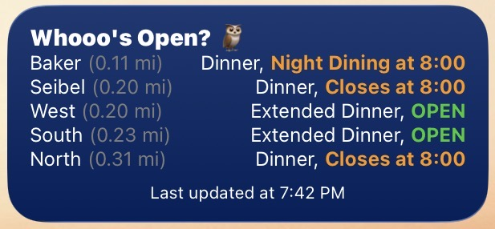

# Whooo's Open? 🦉 (iOS and iPadOS Widget)
A widget to quickly see servery hours on campus at Rice University.

<b>Note</b>: the hours are currently pulled from my website, which is updated manually by me. There is no guarantee I will update these hours consistently if there are changes (due to holidays, events, etc.). Please check Rice Dining for current hours.

Requires <a href="https://scriptable.app/">Scriptable</a> on the App Store.

## Installation Instructions
- Open Scriptable and tap the plus icon.
- Copy the text in <a href="/build/widget.js">widget.js</a> (found in `build` of this repo) and paste into the script.
- Go to your Home Screen, hold down, and add a widget.
- Select Scriptable as the application.
- Select the Medium size.
- Select the correct script to run.

## Update Instructions
- Open Scriptable and either add a new script or edit a script that already exists.
- Copy the text in <a href="/build/widget.js">widget.js</a> (found in `build` of this repo) and paste into the script.
- Any widgets already using this script should update within a few minutes.

## Optional
The widget can also sort serveries based on which is closest to you. This feature is disabled by default. To enable it, enter any truthy value into the parameter space. If metric units are wanted, enter "metric".

## Contributions
If anyone would like to contribute, just put in a pull request and I will check it out. Thanks for the help. :)